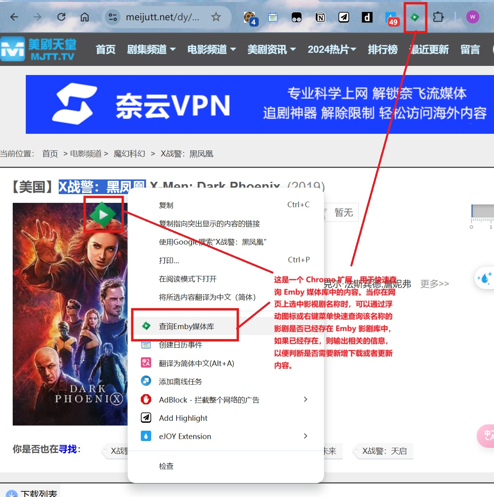
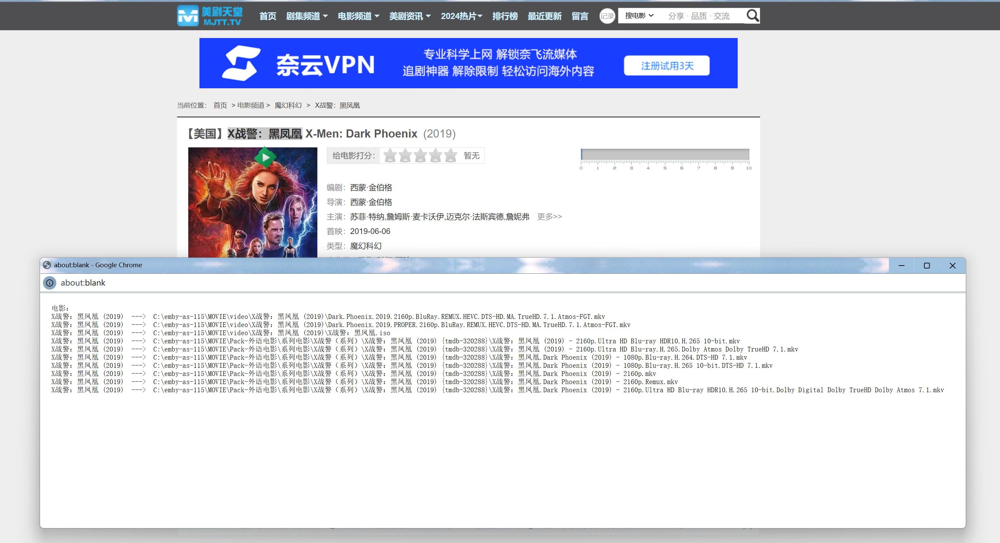
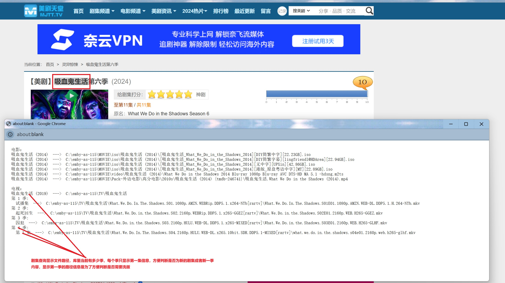
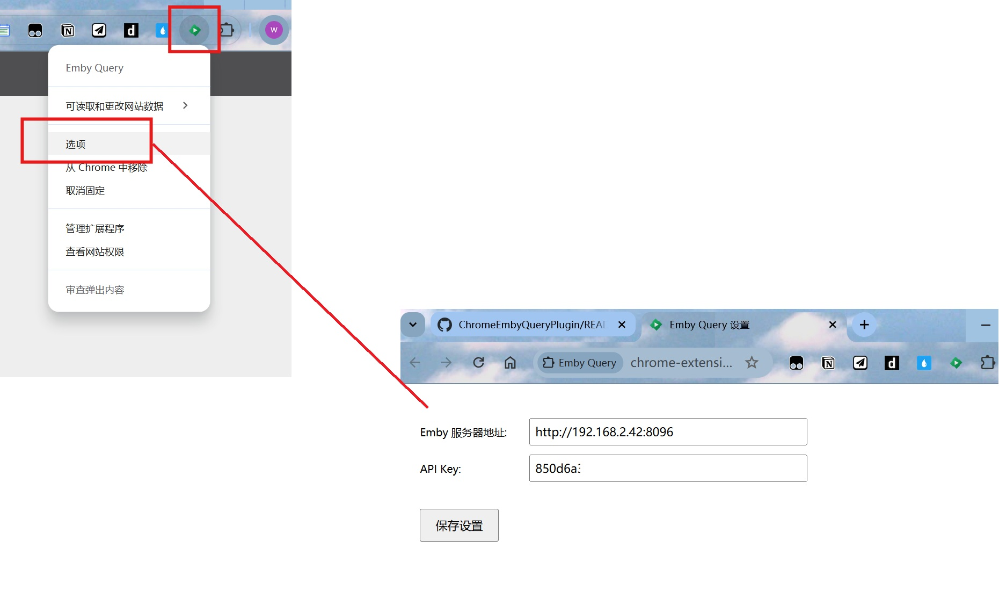

更多交流和技术讨论，请加群：https://t.me/embyfans

# Emby Query Chrome Extension

这是一个 Chrome 扩展，用于快速查询 Emby 媒体库中的内容。当你在网页上选中影视剧名称时，可以通过浮动图标或右键菜单快速查询该名称的影剧是否已经存在 Emby 影剧库中。






## 功能特点

- 选中文本后在右侧显示浮动查询图标
- 支持右键菜单快速查询
- 可配置 Emby 服务器地址和 API Key
- 支持电影和电视剧查询：
    - 电影：列出库中所有该名称的电影和对应的路径
    - 电视剧：列出库中对应的所有季和每季第一集的文件信息，以便判断是否为新剧下载或新一季内容更新

## 安装步骤
下面说明中仅windows系统环境验证过，ubuntu/mac系统中未验证过，如果遇到问题请自行咨询kimi或者deepseek解决

如果你遇到问题/或者自行修复偶尔遇到的问题，请在issues留下说明记录，以帮助修复插件缺陷，谢谢

下载插件代码到本地：
git clone https://github.com/orut34iop/ChromeEmbyQueryPlugin.git

### 1. 安装 uv 并同步 Python 依赖

本项目使用 [uv](https://docs.astral.sh/uv/) 管理 Python 虚拟环境和依赖。

```bash
# 安装 uv（如果尚未安装）
curl -LsSf https://astral.sh/uv/install.sh | sh

# 同步依赖（会自动创建 .venv 虚拟环境）
uv sync
```

如果不使用 uv，也可以手动创建虚拟环境并通过 `pip install -r requirements.txt` 安装依赖。

### 2. 配置后台服务

`server.sh` 会自动检测 `uv`，优先使用 `uv run python server.py` 运行服务；如果未安装 `uv`，则回退到 `.venv/bin/python`。

#### Windows:
- 手动启动服务（推荐）：
  ```powershell
  uv run python server.py
  ```
- `server.bat` 是旧版辅助脚本，未针对 uv 更新，不建议使用。

#### Ubuntu:
```bash
chmod +x server.sh
./server.sh
```

#### Mac:
```bash
chmod +x server.sh
./server.sh
```

注意：这个步骤只需要安装时执行一次，安装插件后每次开机会自动运行后台脚本，所以请不要删除该插件文件夹

### 3. 构建并加载 Chrome 扩展

1. 构建干净的扩展目录：
   ```bash
   uv run python build.py
   ```
   这会生成 `dist/` 文件夹，里面只包含扩展必需的清单、脚本和图标文件。

2. 打开 Chrome，访问 `chrome://extensions/`
3. 开启右上角的"开发者模式"
4. 点击"加载已解压的扩展程序"，选择本项目的 **`dist/`** 目录（不要选择项目根目录，否则会因为 `__pycache__` 等文件导致加载失败）

### 4. 配置扩展

1. 右键扩展图标，选择"选项"
2. 输入你的 Emby 服务器地址和 API Key
3. 点击保存

## 使用方法

1. 在任意网页上选中影视剧名称
2. 点击右侧出现的浮动图标，或右键选择"查询 Emby 媒体库"
3. 结果会在新窗口中显示，包含：
   - 电影：名称、年份和路径
   - 电视剧：名称、年份、各季信息和路径

## 系统要求

- Python 3.6+
- Chrome 浏览器
- 运行中的 Emby 服务器
- 系统支持：
  - Windows 10/11
  - Ubuntu 20.04+
  - macOS 10.15+

## 常见问题

### Windows
- 如需手动启动服务：运行 `server.bat`
- 检查服务状态：任务管理器中查看 Python 进程
  或者通过命令查询： 在powershell中运行命令 "Get-WmiObject Win32_Process -Filter "Name='python.exe'" | Select-Object ProcessId, CommandLine"

### Ubuntu
- 检查服务状态：`systemctl --user status embyquery`
- 手动启动：`systemctl --user start embyquery`
- 查看日志：`journalctl --user -u embyquery`

### Mac
- 检查服务状态：`launchctl list | grep embyquery`
- 手动启动：`launchctl start com.embyquery.server`
- 查看日志：`log show --predicate 'process == "embyquery"'`

## 注意事项

- 确保 Jellyfin / Emby 服务器可访问
- API Key 需要在 Jellyfin / Emby 管理界面生成
- 后端服务默认运行在 3000 端口
- 支持 http 和 https 网站
- 后端默认只监听 `127.0.0.1`，不会暴露到局域网其他设备

## 安全提示

- API Key 仅保存在本地浏览器中
- 所有请求均通过本地服务器中转
- 不会向外部发送敏感信息
